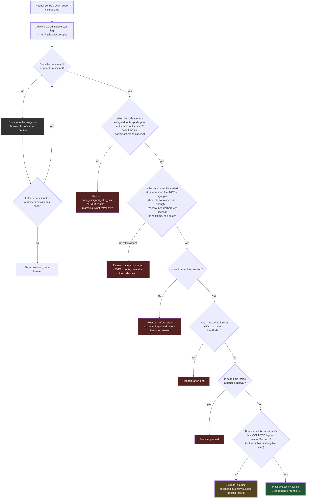

# Scan decision flow

This documents how an incoming RFID scan is turned into (or excluded from)
a counted lap on the leaderboard. **Both fixes below are now implemented**
in `server/domain/race.js` (as of 2026-10-02).

## Diagram



## Fixed bug #1: "race not started" was leaking through

`eligibleScansForParticipant` in `server/domain/race.js` used to filter
scans with:

```js
.filter((s) => !cutoff || s.time >= cutoff)
```

where `cutoff` is the participant's heat `startAt`. When the heat had
**never started** (`startAt` is `null`), `!cutoff` was `true`, so the
filter let the scan through instead of blocking it — "no start time yet"
was treated as "no restriction" instead of "nothing is eligible yet."

Repro: scan a code with no race live and no matching participant yet (shows
as `unknown_code` in history) → add a participant with that exact code →
the old scan immediately got counted as a lap, even though the race was
never live when it happened.

**Why checking `heat.startAt` alone still isn't enough:** "Reset rounds"
deliberately *keeps* each heat's `startAt` so the organizer doesn't have to
re-enter it (see the "Reset race should only clear rounds" decision). That
means after a reset, `heat.startAt` can be non-null while the race is back
in `signup` — so a pure `heat.startAt` check would let scans count again
the moment the race is reset, before "Start race" is even pressed a second
time. **The actual fix checks `race.status !== 'signup'` first**, and only
then falls back to the heat's own `startAt`/`durationMinutes` window. This
is implemented as an early return in `eligibleScansForParticipant`, and
mirrored in `getScanHistory`'s reason logic (`race_not_started` is reported
whenever `race.status === 'signup'`, regardless of what `heat.startAt`
happens to still hold).

## Fixed bug #2 (by design): matching is NOT retroactive

Confirmed with the project owner (2026-10-02): a scan may only count for a
participant if that participant's RFID code was **already assigned at the
time the scan was received** (node `E0` above). A scan received before the
code existed in the system stays `unknown_code` forever, even if a
matching participant/code shows up afterwards — and if a code is
*reassigned* from one participant to another, old scans don't suddenly
start counting for the new holder either.

**Implementation:** every participant now has an `rfidAssignedAt` field —
stamped to "now" whenever `addParticipant` creates them with a code, or
whenever `setParticipantRfidCode` assigns a new non-empty code (cleared
back to `null` when the code itself is cleared). `eligibleScansForParticipant`
gates on `!participant.rfidAssignedAt || s.time >= participant.rfidAssignedAt`
— the `!rfidAssignedAt` half is a backward-compatibility fallback for
participants that existed in a database from before this field existed
(an added `rfid_assigned_at` SQLite column that's `NULL` for old rows is
treated as "always assigned," preserving their existing behavior rather
than retroactively locking out an event that's already mid-race).

## Other reasons in `getScanHistory`

| Reason | Meaning |
|---|---|
| `unknown_code` | No participant currently holds this code |
| `code_assigned_after_scan` | Code now matches a participant, but was assigned to them after this scan happened |
| `race_not_started` | The race is still in `signup` (hasn't been started since the last reset/new race) |
| `before_start` | Scan happened before the heat's `startAt` |
| `after_end` | Scan happened at/after the heat's `startAt + durationMinutes` |
| `paused` | Scan happened while the race was stopped/paused/ended |
| `bounce` | Too soon after the same participant's last counted lap (< `minLapSeconds`) |
| *(none — counted)* | Everything checks out; counts toward `rounds` |
